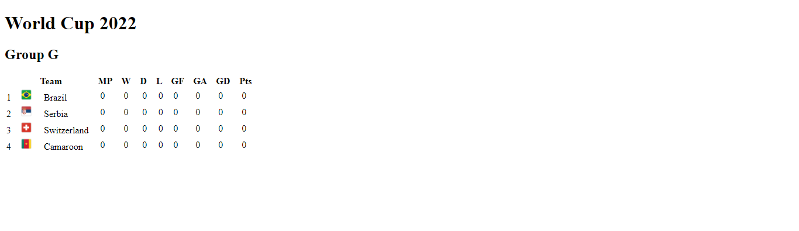

# World Cup's table Group G

To track every bit of my development through the codar.me's input course, I plan to submit my my results and resolutions of the proposed challenges. 

This page corresponds to the second challenge, creating a basic table for one of World Cup's team groups, using only HTML tags.

[Click here to acess](https://manutourinho.github.io/world-cups-table)

## ⚙️ Tecnologies

— HTML

## 💗 Contact

manuelatourinho@outlook.com
manuelatourinhodeoliveira@gmail.com